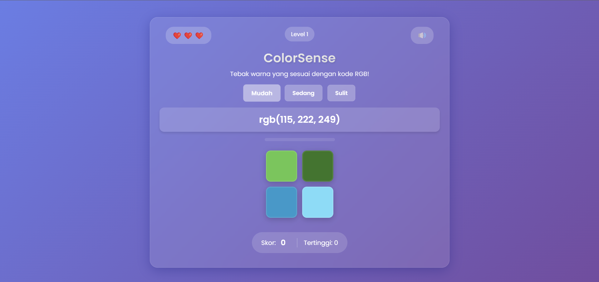
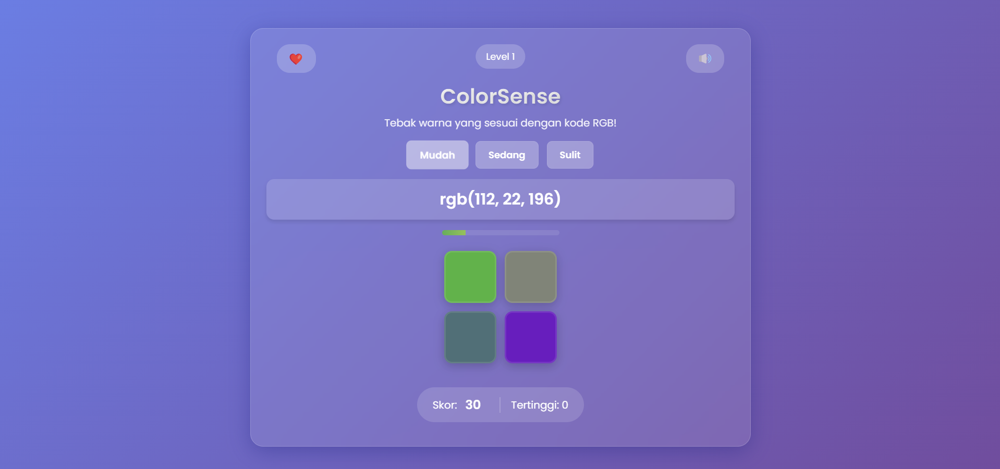
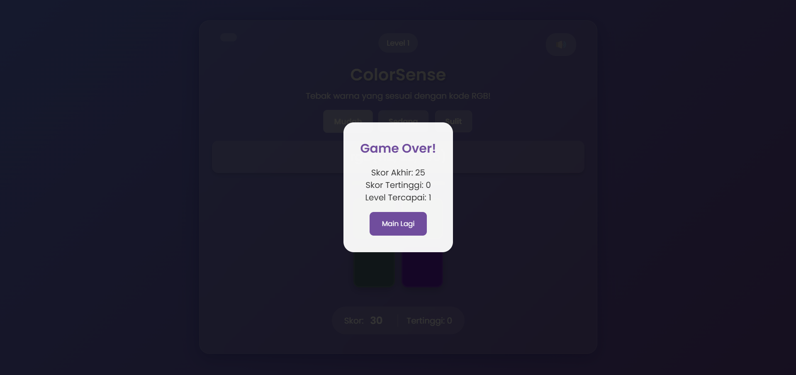

# ColorSense - Game Tebak Warna RGB

## Deskripsi
ColorSense adalah game interaktif berbasis web yang menguji kemampuan pemain dalam mengenali warna berdasarkan kode RGB. Pemain harus memilih warna yang sesuai dengan kode RGB yang ditampilkan dari beberapa pilihan yang tersedia.

## Fitur
- 🎮 3 tingkat kesulitan (Mudah, Sedang, Sulit)
- ❤️ Sistem health/nyawa
- 🏆 Sistem high score
- 🎵 Sound effects
- 📈 Sistem level dan progress
- 🎉 Efek visual dan animasi
- 💾 Penyimpanan high score lokal
- 📱 Responsive design

## Teknologi yang Digunakan
- HTML5
- CSS3
- JavaScript (Vanilla)
- Local Storage API
- Web Audio API

## Cara Bermain
1. Pilih tingkat kesulitan:
   - Mudah: 4 pilihan warna
   - Sedang: 6 pilihan warna
   - Sulit: 9 pilihan warna
2. Perhatikan kode RGB yang ditampilkan
3. Pilih kotak warna yang sesuai dengan kode RGB
4. Dapatkan poin untuk setiap jawaban benar
5. Hindari kehabisan nyawa!

## Sistem Skor
- +10 poin untuk jawaban benar
- -5 poin untuk jawaban salah
- Bonus nyawa setiap naik level
- High score disimpan secara lokal

## Pengembangan
Untuk menambahkan fitur atau melaporkan bug, silakan buat issue atau pull request.

### TODO
- [ ] Menambahkan mode permainan baru
- [ ] Implementasi sistem achievement
- [ ] Menambahkan leaderboard online
- [ ] Optimasi untuk perangkat mobile
- [ ] Menambahkan tema gelap/terang

## Kontribusi
Kontribusi selalu diterima! Silakan fork repository ini dan buat pull request.

## Kredit
- Font: [Poppins](https://fonts.google.com/specimen/Poppins)
- Sound Effects: [Pixabay](https://pixabay.com/sound-effects/)

## Author
[Raviel](https://github.com/raviel17)

## Screenshots

---
⭐ Jangan lupa beri bintang jika Anda menyukai project ini!
